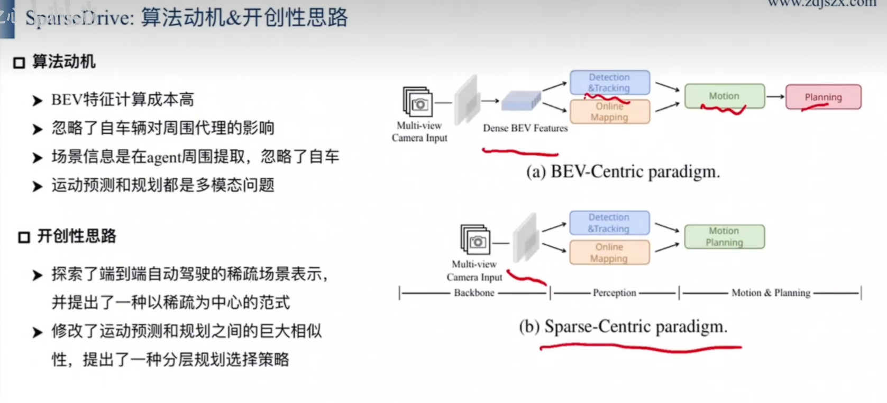
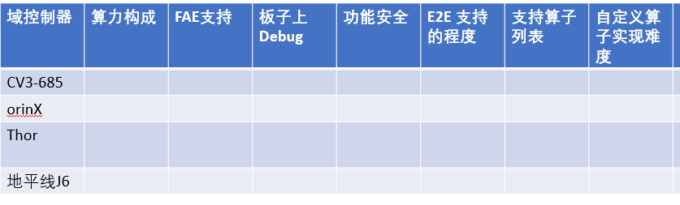

# Adas System DeployMent
## 1. 介绍
本项目旨在逐步部署先进的自动驾驶系统，涵盖以下三种关键技术路径：

1. **端到端（End-to-End）自动驾驶系统**：该阶段的目标是构建一个能够直接从环境感知数据（如摄像头图像、激光雷达点云等）生成车辆控制指令（如转向、加速或减速）的完整系统。端到端方法试图通过单一模型简化自动驾驶的决策过程，减少对复杂子系统的依赖。

2. **端到端结合视觉语言模型（VLM, Vision-Language Model）的自动驾驶系统**：在此阶段，我们将在端到端架构的基础上，引入视觉语言模型来增强系统的理解和决策能力。通过融合视觉信息与自然语言处理，使自动驾驶系统能更好地理解复杂的交通场景，比如识别路标指示、理解交通规则等，从而做出更加安全和合理的驾驶决策。

3. **视觉-语言-动作（VLA, Vision-Language-Action）自动驾驶系统**：最终阶段的目标是开发一个高度集成的自动驾驶系统，它不仅能够基于视觉和语言信息作出决策，还能有效执行这些决策。VLA系统旨在通过更深层次的多模态融合，实现更为精准和灵活的自动驾驶功能，以应对更加复杂多变的现实驾驶环境。

每个阶段都将包括以下几个关键步骤：
- **需求分析与方案设计**：明确项目目标，设计技术路线图。
- **数据收集与预处理**：获取高质量的数据集，包括但不限于图像、视频、点云数据等，并对其进行必要的清洗和标注。
- **模型选择与训练**：基于项目需求选择合适的模型架构，利用收集的数据集进行训练。
- **系统集成与测试**：将训练好的模型集成到自动驾驶平台中，进行模拟及实车测试，确保系统稳定性和安全性。
- **持续优化与迭代**：根据测试反馈不断调整优化模型和算法，提升系统性能。

通过这三个阶段的实施，本项目期望能够推动自动驾驶技术的发展，为未来智能交通系统提供强有力的技术支持。

## 2. SparseDrive Tensorrt Deploy
https://github.com/swc-17/SparseDrive

https://arxiv.org/html/2405.19620v2

SparseDrive 是一种先进的自动驾驶技术框架，它通过结合对称稀疏感知模块和并行运动规划器来实现高效的驾驶场景理解和决策制定。以下是 SparseDrive 的主要组成部分及其工作原理：

### 对称稀疏感知模块
该模块负责处理来自传感器（如摄像头、激光雷达等）的数据，以检测、跟踪和创建驾驶环境的在线地图。它的特点是采用对称模型架构，这意味着在数据处理过程中，输入和输出之间存在某种形式的对称性，这有助于学习到驾驶场景的完全稀疏表示。稀疏表示意味着只关注场景中的关键元素，忽略无关紧要的信息，从而提高处理速度和效率。

### 并行运动规划器
并行运动规划器的设计基于一个观察，即运动预测和路径规划这两个任务之间存在着显著的相似性。因此，通过并行处理这两个任务，SparseDrive 能够更快速地做出反应，并生成更加准确和及时的规划结果。这种并行设计允许系统同时考虑多种可能的运动情景，从而更好地应对复杂多变的驾驶环境。

### 分层规划选择策略
为了从多个可能的运动方案中选择最佳路径，SparseDrive 引入了一种分层规划选择策略。这一策略包括一个碰撞感知重新评分模块，其作用是在所有候选路径中评估每个路径的安全性和可行性，最终选择一条既合理又安全的轨迹作为车辆的实际行驶路线。

通过这些创新性的设计，SparseDrive 不仅提高了自动驾驶系统的感知能力和决策效率，还增强了系统的整体安全性和可靠性。这对于推动自动驾驶技术的发展和实际应用具有重要意义。

## UniAD
自动驾驶系统中的感知、预测和规划技术
这一章节主要介绍了自动驾驶中的感知、定位和规划三个模块的实现方法。其中，感知模块包括了目标检测和跟踪两个任务，用于在三维空间中定位周围物体并对其进行跟踪；在线地图模块则通过传感器数据对道路元素进行分割，并将其转化为鸟瞰图形式；运动预测模块利用之前编码的查询信息和密集特征来预测每个车辆未来K个时间步长内的轨迹；占用率预测模块则通过对场景中所有车辆的交互作用来预测未来的占用率变化情况；最后，规划模块将所有上游结果考虑在内，生成一条总行程轨迹。这些模块共同协作，实现了自动驾驶的安全行驶。

## 3. 域控制器选型

